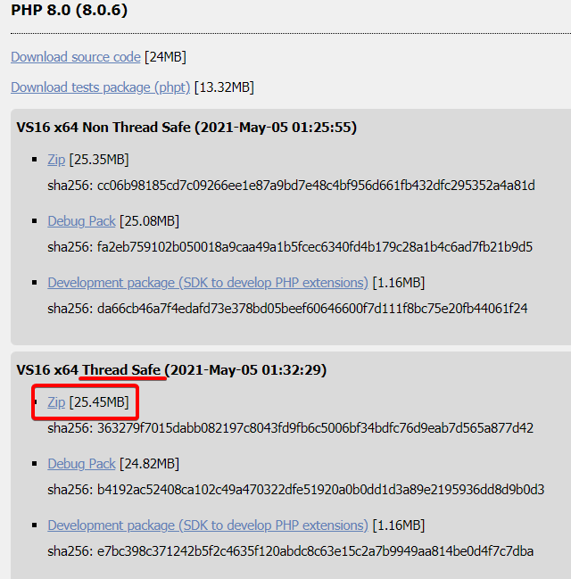

# flarumite/flarum-docker <!-- omit in toc -->

A dockerised install of Flarum designed to aid in development and testing.

This is not designed to be used for production systems.

## Contents <!-- omit in toc -->

- [Setup](#setup)
  - [Prerequisites](#prerequisites)
  - [Setting up PHP](#setting-up-php)
    - [Linux](#linux)
    - [Windows](#windows)
  - [Setting up Composer](#setting-up-composer)
  - [Linux](#linux-1)
    - [Windows](#windows-1)
  - [Setting up Docker](#setting-up-docker)
    - [Linux](#linux-2)
    - [Windows](#windows-2)
  - [Installing Docker compose](#installing-docker-compose)
  - [Access from other devices on your network](#access-from-other-devices-on-your-network)
- [Usage](#usage)
  - [Flarum](#flarum)
  - [CLI access to the container](#cli-access-to-the-container)
  - [Resetting the database](#resetting-the-database)
  - [PHPMyAdmin](#phpmyadmin)
- [Development](#development)

## Setup

You might need to configure a few things before using this container to get it working how you need it.

### Prerequisites

- `git` is set up and configured on your system
- You have a basic understanding of editing configuration files
- You have some experience in the command prompt/interpreter
- You have this repo downloaded where you'd like to install Flarum

### Setting up PHP

#### Linux

PHP installation varies across systems.

One of the most common methods on Ubuntu is via `apt` and a PHP PPA. You're relying on the PPA being trustworthy -- in production systems, you should build PHP from source to ensure you are not running a build that has been modified maliciously.

```properties
sudo add-apt-repository ppa:ondrej/php
sudo apt update
sudo apt install php8.0
```

#### Windows

You'll need PHP installed locally to use Composer. [**Download PHP 8.0 for Windows.**](https://windows.php.net/download#php-8.0)



You need to extract this to a folder on your PC, then add this folder to your PATH. I recommend a location such as `C:\PHP8`, or similar.

**Adding to your system PATH:**

1. Press <kbd>⊞ Win</kbd> and search for "environment variables"
2. In the new window, click "Enviro<u>n</u>ment Variables..."
3. In the bottom-half of the new window (labelled system variables), double-click "Path"
4. Click "New" on the right, then enter the path to your PHP folder (e.g. `C:\PHP8`)
5. Click "OK" until all windows are closed
6. Open command prompt (<kbd>⊞ Win</kbd> + <kbd>R</kbd>, `cmd`, <kbd>⏎ Enter</kbd>), then run `php -v` to ensure you're using the correct version and PHP could be found.
   - If PHP isn't found or recognised, you might need to restart your PC for the environment variable changes to take effect.

### Setting up Composer

Composer is used to install Flarum itself, so it's pretty important. You'll also use it to install extensions, too.

### Linux

Follow the command-line installation instructions here: https://getcomposer.org/download/

If you want to run `composer` from anywhere (recommended), then you also need to move it to your `bin` folder:

```properties
sudo mv composer.phar /usr/local/bin/composer
```

You can check it installed correctly by opening a command prompt and running `composer -V`.

#### Windows

Download the latest Composer setup from the Composer website: https://getcomposer.org/Composer-Setup.exe

Run it, choose "All users", then follow the instructions. Make sure to point it to the `php.exe` file in your PHP install directory, and to choose to use the `php.ini` file it will create for you.

You can check it installed correctly by opening a command prompt and running `composer -V`.

### Setting up Docker

You will need to set up and configure your system to work with Docker.

#### Linux

Follow the installation instructions on the Docker website for your Linux distro: https://docs.docker.com/engine/install/ubuntu/

#### Windows

<details>
<summary>Click to view Windows setup instructions</summary>

Please see the official Docker documentation: https://docs.docker.com/docker-for-windows/install/

Ensure that you follow the **WSL 2 backend** procedure.

**Important note:** PLEASE take a system restore backup before configuring your system for Docker. Some modern AMD laptops (Ryzen 3000+) are known to have issues with WSL 2. These can be fixed with a BIOS update from the laptop OEM or by configuring some options in the BIOS. Some devices also have their WiFi disabled when enabling virtualisation, displaying "Code 48" in device manager.

For more info, see:

- https://answers.microsoft.com/en-us/windows/forum/all/windows-pro-version-2004-intel-wifi-disabled-with/363e887b-31b0-457b-9a1c-8203c0007023?page=2
- https://github.com/microsoft/WSL/issues/5911#issuecomment-741580494
- https://h30434.www3.hp.com/t5/Gaming-Notebooks/WSL2-HyperV-is-causing-BSOD-on-HP-Pavilion-Gaming-Laptop-15/td-p/7834558
- https://www.reddit.com/r/bashonubuntuonwindows/comments/ia9evb/bsod_on_boot_when_trying_to_install_wsl2_on_ryzen/
- https://community.amd.com/t5/processors/wsl-2-hyper-v-amd-ryzen-7-pro-4750u-bsod/td-p/432794
</details>

### Installing Docker compose

Docker compose allows you to set up Docker containers from a configuration file (called a compose file).

Follow the Docker setup instructions: https://docs.docker.com/compose/install/

> **You only need to perform this setup on Linux and Mac. Docker Desktop comes with Compose out of the box.**

### Access from other devices on your network

To allow access to the forum from other devices on your network, or from devices outside your network if you have set up port forwarding, you need to perform a minor configuration change.

You might not need this, but if you want to test on multiple devices, it can be very helpful. You'll also need this if you install Flarum on a server via Docker to be able to access it on client devices.

Open the compose file (`docker-compose.yml`). Under the "PHP Apache Docker container", find the `ports:` entry and uncomment `80:8080`, and comment `127.0.0.1:80:8080`.

It should look like this:

```yml
ports:
  # - "127.0.0.1:80:8080"
  # Switch to this line if you want to access Flarum from other devices on your network
  - "80:8080"
```

> **Note:** this does not expose the database and PHPMyAdmin to any other devices on your local network. You usually shouldn't do this, as if these ports are forwarded on your router, you could open yourself to security risks via people modifying your database.
>
> If you're only using this within your local network, you can enable access to PHPMyAdmin and the MySQL server by copying the same `ports` syntax to those sections in the compose file.

## Usage

From the root of the repository, run:

```properties
# Installs Flarum and other needed dependencies
composer install
# Builds the docker container
docker-compose build
# Runs the containers
docker-compose up
```

After this, your forum will be available for use.

### Flarum

The Flarum installation will be available at `http://localhost`

**Default credentials:**

| Username    | Password    | Type      |
| ----------- | ----------- | --------- |
| `flarumite` | `flarumite` | admin     |
| `moderator` | `flarumite` | moderator |
| `user`      | `flarumite` | normal    |

### CLI access to the container

To perform some actions, e.g. those done via the Flarum CLI, you'll need command-line access to the Flarum docker container.

This command will get you to a bash interpreter:

```properties
docker exec -it flarum-svc /bin/bash
```

You can then run Flarum CLI commands, as well as many others, like normal.

> **Tip:** If you just want to clear the cache, try the `clear-cache.sh` helper script first. This should work on Windows, Mac and Linux.

### Resetting the database

If you've messed it all up and need to reset the Flarum database to a known good state, run the `resetdb` script:

```properties
./scripts/dev/resetdb.sh
```

> **Note:** this requires `mysql-client` to be available locally. This also needs to be run in Linux using bash.

### PHPMyAdmin

PMA can be accessed at `http://localhost:8002`

Default credentials:

Username: `flarum`
Password: `flarum`

## Development

You can also develop on local packages using this container.

1. Create an extension from a template or clone an existing repo to the `workbench` folder.
2. Run `composer require <vendor/package>`, inserting your package name into the command
3. Enable the extension inside Flarum's admin page

You can also do this with Flarum's core by cloning the repo and running `compose require flarum/core`. Any packages in the `workbench` folder will take precedence over those downloaded by Composer from Packagist.

If you want to go back to the latest published version of an extension/package, remove it from your `workbench` folder, then run `composer update -W <vendor/package>`.

This ties in nicely with the CLI access provided by `docker exec`, explained above.
